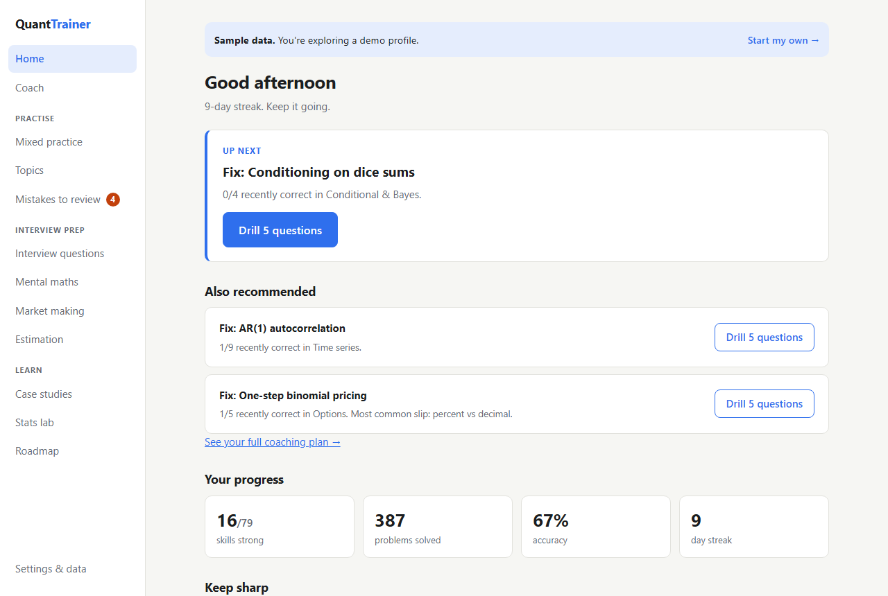
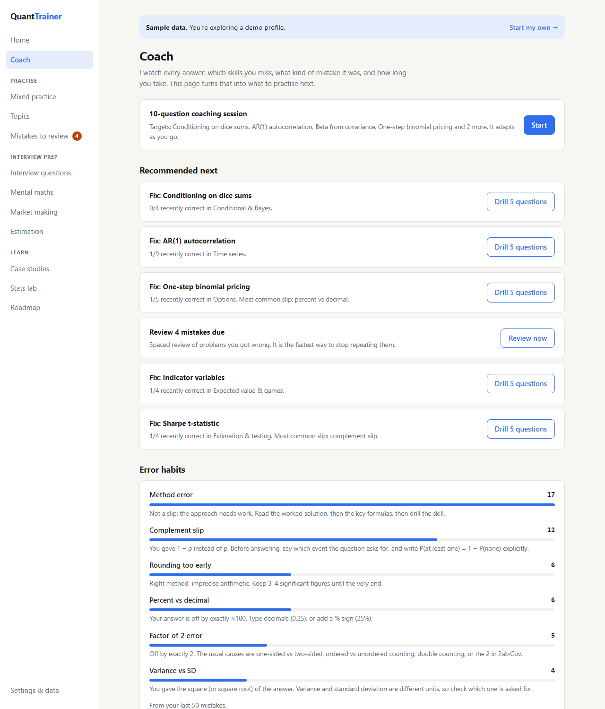
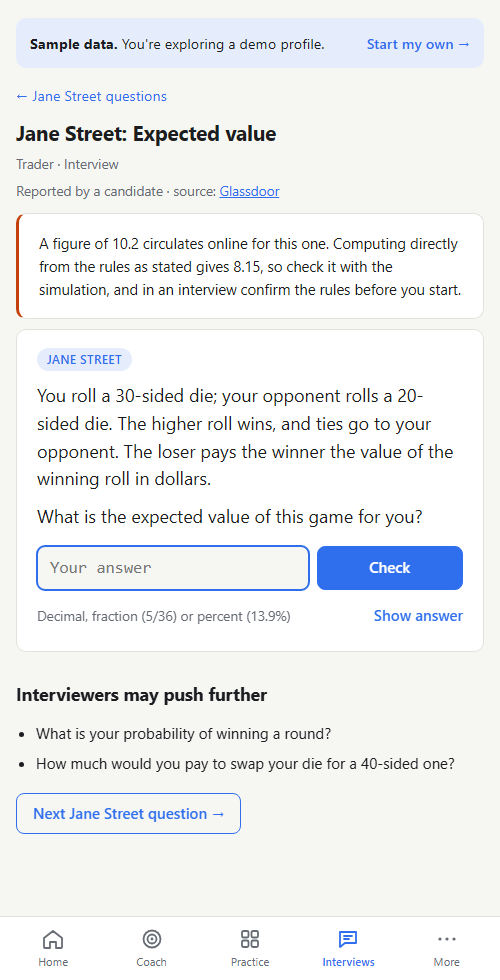
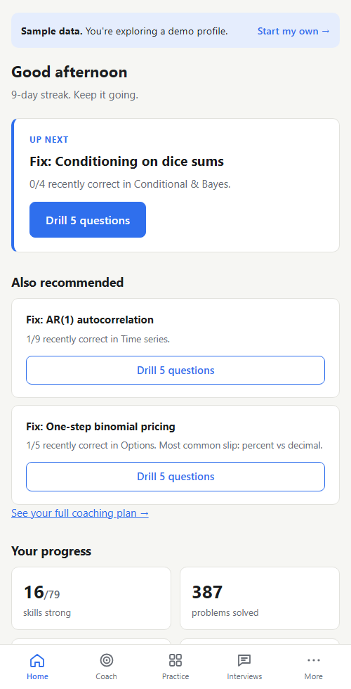

# Quant Trainer

**Interview practice for quant trading: probability, statistics, mental maths and market making, with an adaptive coach and real questions candidates report from trading firms.** It runs as a website and an Android app from one codebase.

[](https://github.com/pingadom/quant-trainer/actions/workflows/ci.yml)
[](https://github.com/pingadom/quant-trainer/actions/workflows/deploy.yml)
[](https://github.com/pingadom/quant-trainer/releases/latest)
[](LICENSE)

**[Open the app](https://pingadom.github.io/quant-trainer/)** · **[Explore with sample data](https://pingadom.github.io/quant-trainer/?demo#/coach)** · **[Android APK](https://github.com/pingadom/quant-trainer/releases/latest)** · **[Research report](research/REPORT.md)**



| Coach and skill map | A reported interview question | On a phone |
|---|---|---|
|  |  |  |

## Technical highlights

- **A learner model chosen by out-of-sample evaluation.** The coach estimates your chance of answering each of its 84 skills. I compared seven models (per-skill Beta, Elo, Bayesian Knowledge Tracing, Performance Factor Analysis and others) prequentially on simulated learners, with two structurally different ground truths and bootstrap CIs. The original per-skill estimate turned out to be biased by the app's own question selection. Elo beat it under both truths (log loss −0.046 and −0.024, 95% CIs clear of zero) and now drives the coach. → [research/REPORT.md](research/REPORT.md)
- **Every answer checked twice, by different methods.**
  - In the app, Monte Carlo simulations are tested against the exact answers within 5 standard errors.
  - In CI, a separate [Python derivation](research/verify_results.py) of every interview answer (exact fractions, the Bellman equation, Markov chains, a linear program for a poker game) must match what the app serves: **63/63 agree**.
  - This caught a widely circulated wrong answer to a reported Jane Street question (10.2; the correct value is 8.15).
- **Diagnoses the kind of mistake, not just whether you were wrong.** Wrong answers are classified as complement slip, percent vs decimal, factor of 2, variance vs SD, rounding, and so on, and the advice targets that slip. Missed questions return on a spaced-repetition schedule.
- **Trading games with testable engines.**
  - Figgie bots value cards with the exact Bayesian posterior over the 12 possible decks; tests check it is calibrated and that full bot games conserve cards and chips.
  - Bet sizing is scored by expected log-growth against Kelly, so a lucky run can't hide over-betting.
  - The daily challenge is generated from the date with a seeded RNG, so everyone gets the same questions without a server.
- **One codebase, website + native app.**
  - Plain HTML/JS with no build step, deployed as an offline-capable PWA.
  - Wrapped with [Capacitor](https://capacitorjs.com/) for Android and iOS. CI builds the APK and a signed Play Store bundle.
  - Platform differences (storage, export, back button) live in [one module](www/js/platform.js).
- **Engineering hygiene.**
  - ESLint; unit tests run in Node and the browser.
  - Playwright end-to-end tests on desktop and a touch phone, including offline mode.
  - axe accessibility checks and WCAG AA colour contrast; Lighthouse in CI.
  - A Content Security Policy, and schema validation that stops an imported progress file from injecting script.

## What's inside

| | |
|---|---|
| **Interview plan** | Pick the firm and date; get a daily checklist weighted to what that firm tests, with a countdown on the home screen. |
| **Coach** | Tracks 84 skills, diagnoses error types, ranks what to practise next with reasons, and offers a 15-question diagnostic and one-tap drills. |
| **Practice** | 15 topics and 84 randomised question generators with worked solutions and a "check by simulation" button. Adaptive mixed practice. |
| **Interview questions** | 43 questions: ones candidates report from Jane Street, SIG, Optiver, IMC, Citadel, Five Rings, Two Sigma, Flow Traders, Wincent, Akuna, Da Vinci and DRW (plus clearly labelled practice questions on the topics firms list), each sourced, with follow-ups and a timed mock-interview mode. |
| **Mistakes to review** | Every wrong answer comes back after 1, 3, 7 and 21 days until mastered. |
| **Daily challenge** | The same 5 questions for everyone each day (seeded from the date, no server), one attempt, with a shareable result and streak. |
| **Think aloud** | Talk a reported question through out loud against the clock, record yourself (kept on the device), see pace and filler words, then score yourself against what interviewers listen for. |
| **Mental maths** | The "80 in 8" format with net scoring, answered as multiple choice or typed, plus a 2-minute sprint. Slow and missed questions come back afterwards with the fast method worked on their own numbers, and slow question types return as spaced, timed speed reps. |
| **Speed tricks** | 20 short guides to faster arithmetic (near-100 multiplication, squaring, fractions, last-digit checks, guessing strategy under negative marking…), each with a drill that walks through the trick. |
| **Online tests** | Timed number sequences, digit span and running-total tasks, the kinds of screen many firms use before interviews. |
| **Figgie** | Jane Street's card trading game against three bots (Bayesian, flow-following and noise), with the Bayesian maths from your hand on request. |
| **Make me a market** | The live interview format: quote a two-sided price, the interviewer trades against you, you re-quote. Scored on width, P&L and moving with the flow. |
| **Bet sizing** | 20 bets with known odds; you choose the stake. Compared with Kelly and half-Kelly, scored by expected log-growth so luck doesn't count. |
| **Market making** | Quote on hidden dice against informed and noise traders. |
| **Estimation & calibration** | Range quoting on 43 fact-checked quantities; checks whether your 90% ranges really contain the answer 90% of the time. |
| **Themes** | Notebook, Night desk, Chalkboard and Terminal, with a ticker tape of your numbers, milestone stamps and an optional closing bell. Every theme is checked for WCAG AA contrast in CI. |
| **Progress** | Charts of accuracy, speed, 80-in-8, calibration and every game over time, an activity heatmap, and speed against target by topic. |
| **Case studies** | 14 real market events (LTCM, Black Monday, Volmageddon, negative oil, …) as statistics lessons, with sources. |

## Run it

```bash
npm run serve                     # then open http://localhost:8765/www/
```

No build step: any static file server works, and opening `www/index.html` directly works too (without offline mode).

```bash
npm install
npm test                          # unit tests: generators, simulations, security, coach
npm run lint
npm run test:e2e                  # Playwright, desktop + phone, with accessibility checks
pip install -r research/requirements.txt
npm run verify                    # Python re-derivation vs the app's answers
npm run research                  # learner-model study → research/REPORT.md
```

## How it's built

- **Code:** [`www/`](www/) is the whole app: views in `js/views/`, the coach and Elo model in `js/coach.js`, storage and input validation in `js/core.js`. See [docs/ARCHITECTURE.md](docs/ARCHITECTURE.md).
- **Website:** every push to `main` is tested and deployed to GitHub Pages; Netlify and Vercel configs are included.
- **Android and Play Store:** tagging a version builds the APK. Releases and Play Store signing are covered in [docs/RELEASING.md](docs/RELEASING.md).
- **Privacy:** all progress stays on the device. See the [privacy notice](https://pingadom.github.io/quant-trainer/privacy.html).

## Contributing

If you've had a quant interview, the most useful thing you can add is a question you were asked. The [question form](https://github.com/pingadom/quant-trainer/issues/new?template=interview-question.yml) takes two minutes. See [CONTRIBUTING.md](CONTRIBUTING.md).

## Acknowledgements

Interview questions are paraphrased from public candidate reports and linked to their sources; firms' names are used only to attribute those reports.

## License

[MIT](LICENSE)
