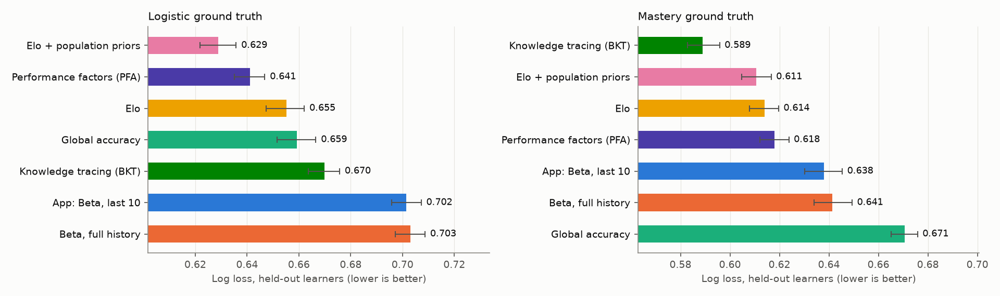
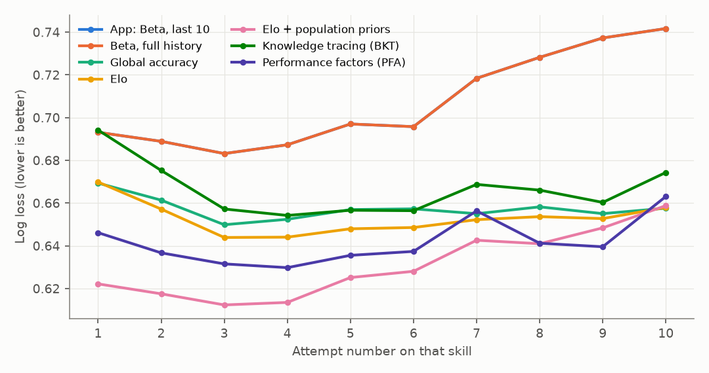
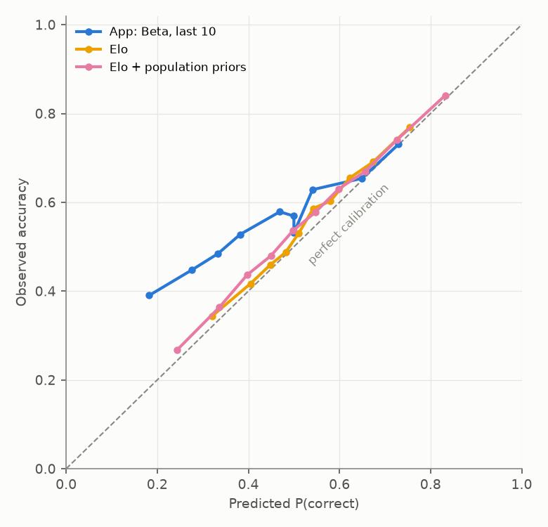
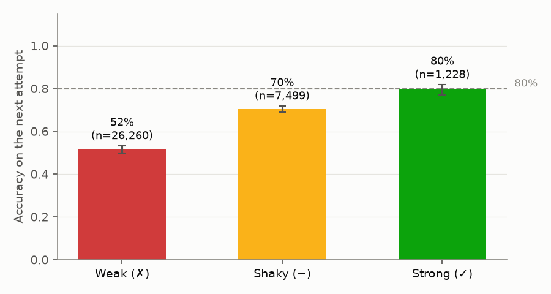

# Which learner model best predicts the next answer?

*Generated by [`learner_models.py`](learner_models.py) (seed 7). Re-run it to reproduce every number and figure.*

## Why this matters

The app's coach decides what you should practise next from an estimate of how likely you are to answer each of its 79 skills correctly. If that estimate is poor, the recommendations are too. The app currently uses a simple per-skill **Beta(1,1) posterior over your last 10 answers**. This study asks whether that's a good choice, and what would be better.

## Method

- **Learners.** 300 simulated learners practise for 30 days, 15 questions a day, with questions **chosen by the app's own policy** (weighted towards weak skills, an immediate repeat after a miss, rest after three correct). The evaluation therefore reflects the data the app would actually collect, including its selection bias.
- **Two ground truths,** so the conclusion isn't an artefact of one modelling assumption:
  - *logistic*: P(correct) = σ(ability + topic aptitude + knowledge − difficulty). Knowledge grows with practice and decays between sessions. This is structurally close to Elo.
  - *mastery*: each skill is mastered or not, can be learned on each attempt and forgotten over long gaps, with slips and guesses. This is structurally close to BKT.
- **Seven models:** the app's model; a full-history Beta; overall accuracy; Elo (learner ability shared across skills plus per-skill easiness); Elo with population skill-difficulty priors (what a server could provide); Bayesian Knowledge Tracing (BKT); Performance Factor Analysis (PFA).
- **Prequential evaluation:** every model predicts each answer *before* seeing it, then updates. Hyperparameters are fitted on 150 training learners only. Every reported number comes from 150 **held-out** learners (67,500 answers per ground truth). Confidence intervals bootstrap over learners (2,000 resamples), and differences against the app are paired per learner.

## Results

**Logistic ground truth**

| Model | Log loss | Δ vs app (95% CI) | Brier | AUC |
|---|---|---|---|---|
| Elo + population priors | 0.629 | -0.073 [-0.076, -0.070] | 0.220 | 0.694 |
| Performance factors (PFA) | 0.641 | -0.060 [-0.066, -0.055] | 0.225 | 0.672 |
| Elo | 0.655 | -0.046 [-0.049, -0.043] | 0.232 | 0.646 |
| Global accuracy | 0.659 | -0.042 [-0.046, -0.039] | 0.233 | 0.640 |
| Knowledge tracing (BKT) | 0.670 | -0.032 [-0.036, -0.028] | 0.239 | 0.611 |
| App: Beta, last 10 | 0.702 | +0.000 [+0.000, +0.000] | 0.252 | 0.608 |
| Beta, full history | 0.703 | +0.002 [+0.001, +0.002] | 0.253 | 0.607 |

**Mastery ground truth**

| Model | Log loss | Δ vs app (95% CI) | Brier | AUC |
|---|---|---|---|---|
| Knowledge tracing (BKT) | 0.589 | -0.049 [-0.053, -0.044] | 0.200 | 0.742 |
| Elo + population priors | 0.611 | -0.027 [-0.030, -0.025] | 0.210 | 0.720 |
| Elo | 0.614 | -0.024 [-0.026, -0.022] | 0.211 | 0.716 |
| Performance factors (PFA) | 0.618 | -0.020 [-0.025, -0.015] | 0.213 | 0.714 |
| App: Beta, last 10 | 0.638 | +0.000 [+0.000, +0.000] | 0.222 | 0.687 |
| Beta, full history | 0.641 | +0.003 [+0.003, +0.004] | 0.223 | 0.682 |
| Global accuracy | 0.671 | +0.033 [+0.027, +0.038] | 0.239 | 0.603 |

## Findings

1. **Elo beats the app's model under both ground truths.** It cuts log loss by 6.6% under the logistic truth (Δ -0.046, 95% CI [-0.049, -0.043]) and by 3.8% under the mastery truth (Δ -0.024, CI [-0.026, -0.022]). Under the logistic truth, 5 of the other six models beat the app, even a single overall-accuracy number. Under the mastery truth, 4 do.
2. **The cause is noisy per-skill estimates, made worse by selection bias.** A per-skill Beta knows nothing about a skill you haven't tried (it predicts 50%) and swings wildly on a few answers. That alone explains its poor first attempts. But its gap to the other models **widens** as a skill accumulates attempts (chart below). The skills that reach many attempts are the ones the app kept choosing *because they looked weak*, and selecting on a noisy low estimate guarantees it is biased low: regression to the mean, a winner's curse in reverse. Models that **shrink each skill towards the learner's overall ability** (Elo, PFA) correct for this. (The two Beta lines coincide for the first 10 attempts, as they must, since the window is 10.)
3. **The best model depends on the truth, but Elo is robust.** Each truth favours the model with its own shape: under the mastery truth the winner is Knowledge tracing (BKT) (Δ -0.049), and under the logistic truth Elo with population priors wins (Δ -0.073, CI [-0.076, -0.070]). Of the models that need no per-skill data from other learners (unlike PFA and the priors variant), plain Elo is the most consistent: it ranks 3rd of 7 under the logistic truth and 3rd under the mastery truth, while BKT swings from 1st to 5th. Priors learned from other learners help further, but the app has no server, so they would need an opt-in way to pool anonymous data.
4. **The app's status labels are still meaningful.** Even though its probabilities are poorly calibrated, ranking skills by them works: answers on skills labelled *strong* were then correct far more often than on *weak* ones, close to the thresholds the labels imply (strong ≥ 80%, weak < 55%).

**Do the labels mean what they say?** (logistic truth)

| App label | Next-attempt accuracy | 95% CI | Answers |
|---|---|---|---|
| Weak | 51.7% | 49.9%–53.4% | 26,260 |
| Shaky | 70.5% | 69.0%–72.0% | 7,499 |
| Strong | 79.6% | 77.0%–82.0% | 1,228 |

(mastery truth)

| App label | Next-attempt accuracy | 95% CI | Answers |
|---|---|---|---|
| Weak | 38.4% | 36.9%–40.1% | 32,409 |
| Shaky | 74.6% | 73.0%–76.3% | 3,285 |
| Strong | 81.0% | 77.9%–84.1% | 630 |

## Recommendation

Use an **Elo-style model** (one learner ability plus per-skill easiness with shrinking step sizes) to decide what to practise. It needs no server, has three hyperparameters, and beats the current model under both ground truths. Keep the status labels, which validate well.

**Shipped in v0.8.0.** [`www/js/coach.js`](../www/js/coach.js) now chooses questions with Elo, using K_θ = 0.05, K_β = 0.6, decay = 0.05: the setting with the best *average* log loss across both ground truths on training learners. (Fitted per truth, the optima were K_β = 0.3, decay = 0.4 under the logistic truth and K_β = 1.0, decay = 0.05 under the mastery truth, so the compromise trades a little accuracy in each for robustness.) The status labels are unchanged, and existing users' Elo state is rebuilt from their answer history.

## Limitations

- **Synthetic data.** Real learners may differ: question difficulty varies within a skill because the numbers are randomised, motivation drifts, people look things up. The two-truth design guards against favouring one model family, but it is not real data. Run `python research/learner_models.py --export your-progress.json` to score the models on your own answer history (the app records it from v0.8.0).
- **The simulated learners follow the pre-0.8 selection policy** (questions chosen with the per-skill Beta). Re-running under the new Elo-driven policy is a natural next step, since selection bias was part of the problem.
- **One fitted parameter set per model**, shared across skills, for BKT and Elo. Per-topic parameters would likely help the stronger models further.
- **Log loss rewards calibration as well as ranking**, which is what the coach needs. AUC (ranking only) is reported too.
